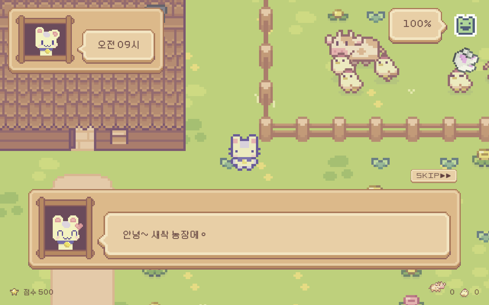
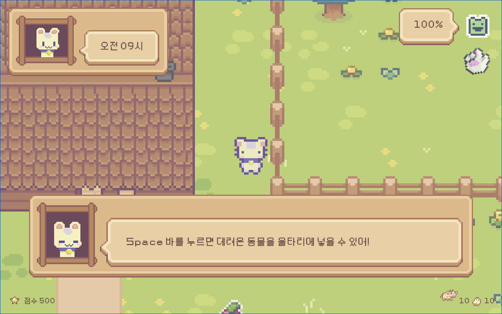
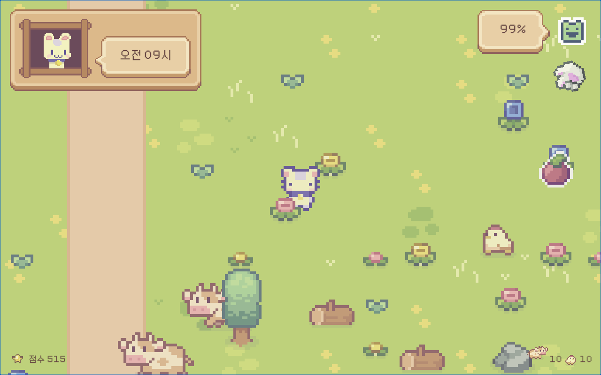
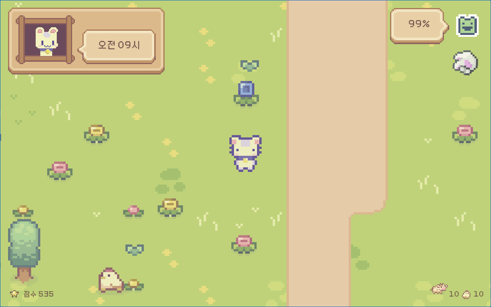
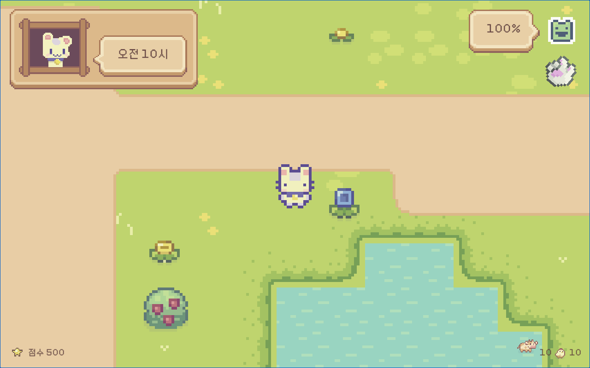
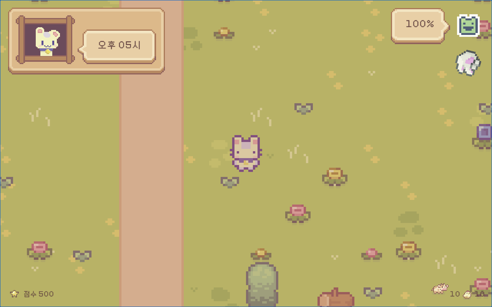
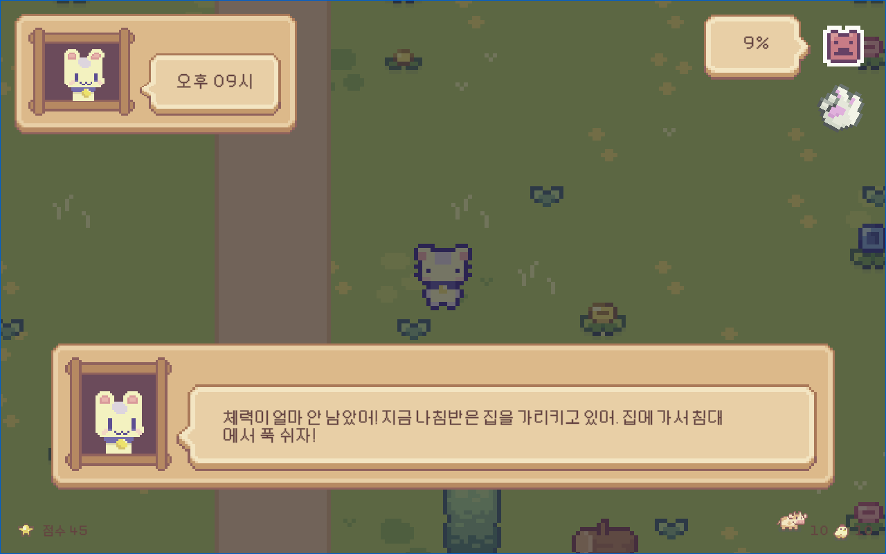
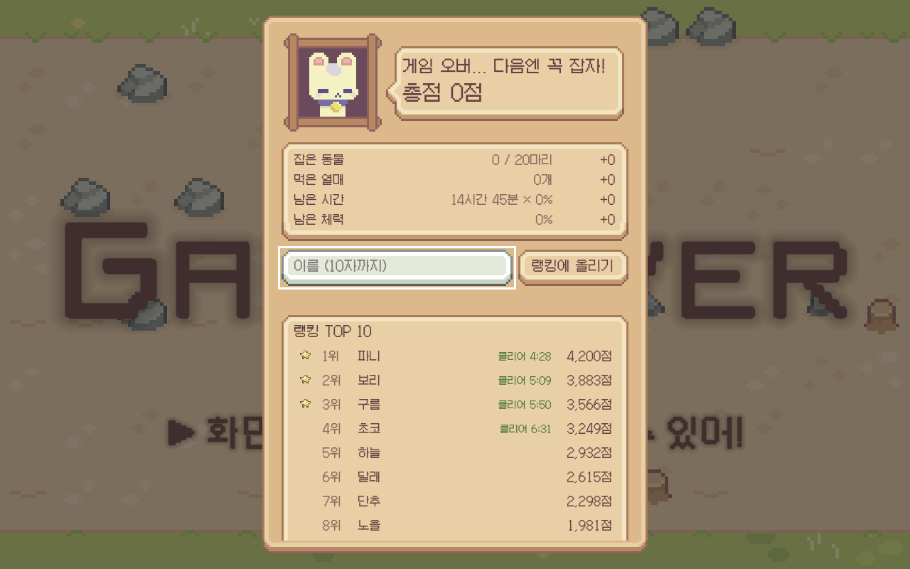

📅 2024.06.10 ~ 2024.06.24 · 업데이트 2026.09
| [🎮플레이](https://sprout-farm-beta.vercel.app)

**※ PC 환경에서만 작동합니다.** (방향키·Shift·Space 조작)

# *SproutFarm 새싹 농장*이란?

타일맵을 이용한 `탑다운` 2D `픽셀` 게임으로, 간단한 조작으로 짧은 시간에 누구나 쉽게 즐길 수 있는 `캐주얼` 미니 게임입니다.👾

## 게임 화면

| 도입 | 농장 |
|------|------|
|  |  |
| 파니가 상황을 설명해 줍니다. `SKIP▶▶`으로 건너뛸 수 있습니다. | 집과 울타리. 안내 대화가 조작 방법을 알려줍니다. |

| 들판 | 흙길 |
|------|------|
|  |  |
| 도망친 동물과 꽃·열매가 흩어져 있는 들판. | 들판을 가로지르는 흙길. 위를 달리면 덜 지치고 빨라집니다. |

| 연못 | 노을 |
|------|------|
|  |  |
| 구역마다 생기는 연못. 물은 지나갈 수 없습니다. | 시간이 지나면 화면 색이 바뀝니다. 오후가 되면 노을이 집니다. |

| 밤 | 결과와 랭킹 |
|------|------|
|  |  |
| 밤에는 어두워지고, 체력이 떨어지면 나침반이 집을 가리킵니다. | 점수 내역과 TOP 10 랭킹. 이름을 넣어 기록을 올릴 수 있습니다. |

## 어떤 게임인가요?

`파니`는 농장을 운영하고 있습니다. 평화롭던 어느날... 한눈을 판 사이에 키우던 동물들이 도망가 농장의 평화가 깨져버렸습니다!! 날이 지나면 동물들을 찾기가 어려워져요😱 자정이 되기 전에 동물들을 찾으러 갑시다..!

### 조작 방법

상하좌우 `방향키`로 움직이고 `Shift 키`로 달립니다. `Space 바`는 대화 넘기기, 울타리에 동물 넣기, 집에서 잠자기 같은 특수 행동에 씁니다. 자정이 지나기 전에 동물 20마리를 모두 잡아 울타리에 넣으면 승리합니다.

### 규칙

- **패배 조건** — 자정이 되거나 체력이 0%가 되면 집니다.
- **동물** — 도망 상태에서는 주변을 배회하다 플레이어가 다가오면 도망칩니다. 잡히면 플레이어를 따라다니고, 울타리에 넣으면 그 안을 돌아다닙니다.
- **체력** — 걸으면 천천히, 달리면 빠르게 닳습니다. 쉬지 않고 계속 움직이면 피로가 쌓여 더 빨리 닳고 이동 속도도 느려집니다. 멈춰 있으면 회복됩니다.
- **열매** — 들판의 열매를 먹으면 체력이 차고 잠시 빨라집니다.
- **잠자기** — 집 침대에서 `Space`로 자면 체력이 가득 차고 게임 시계가 1시간 지나갑니다. 체력이 70% 이상이면 잠이 오지 않습니다.
- **흙길** — 길 위에서는 체력이 평소의 35%만 닳고 1.25배 빨리 움직입니다.

### 점수와 랭킹

한 판이 끝나면 아래 공식으로 점수를 매기고, 이름을 넣어 랭킹에 올릴 수 있습니다. 진행 중에도 화면 왼쪽 아래에 실시간 점수가 표시됩니다.

| 항목 | 점수 |
|------|------|
| 잡은 동물 (따라오는 중 포함) | 마리당 100 |
| 먹은 열매 | 개당 20 |
| 남은 체력 | 1%당 5 |
| 자정까지 남은 게임 시간 | 1분당 2 × (잡은 동물 ÷ 20) |
| 클리어 보너스 | 1000 |

랭킹은 TOP 10을 보여주고, 클리어한 기록에는 걸린 시간도 함께 표시됩니다. 점수는 서버에서 같은 공식으로 다시 계산해 저장하므로 임의의 점수를 올릴 수 없습니다.

### 맵 구성

- 픽셀 아트로 된 평화로운 자연 배경입니다. 타일맵으로 되어 있으며, 크기에 제한을 두지 않는 **무한 맵**입니다.
- 집에서 멀어지면 같은 벌판이 이어지지 않도록, 플레이어 주위를 12칸짜리 구역으로 나눠 **숲 · 바위밭 · 꽃밭 · 과수원 · 연못 · 빈터** 중 하나를 깔아 둡니다. 구역의 위치로 풍경이 정해지므로 같은 곳에 다시 가면 같은 풍경이 나옵니다.
- **연못**에는 물가와 수련잎이 생기고 물은 지나갈 수 없습니다. **흙길**은 24칸 간격으로 구불구불 이어지며, 집 현관 앞에서 남쪽 큰길까지 진입로가 놓여 있습니다.
- 소와 닭은 플레이어가 추적하는 대상입니다. 맵 내부를 자유롭게 돌아다니다가 플레이어가 가까이 다가오면 플레이어를 피해 도망갑니다.

### 기술 스택

| 분류 | 사용 기술 |
|------|-----------|
| 엔진 | Unity 6 (6000.6.2f1), C# |
| 렌더링 | URP 17.6 · 2D Renderer, 투명 정렬 축을 Y로 둔 커스텀 정렬 |
| 맵 | Tilemap (Rule Tile, 47조각 블롭 타일셋), 런타임 절차적 생성 |
| 입력 | Input System 1.20 |
| AI | A* Pathfinding Project 4.2.17 (Grid Graph, 부분 재스캔) |
| UI | uGUI · TextMeshPro |
| 배포 | WebGL (Brotli 압축) → Vercel 정적 호스팅 |
| 서버 | Vercel 서버리스 함수 (`api/scores.js`) + Redis |
| 웹 | Service Worker (network-first 캐시), 랭킹 UI는 HTML·JS |

# Features

## [Assets](https://cupnooble.itch.io/sprout-lands-asset-pack)

| Player | Particle |
|----------|----------|
|  |  |

| Cow | Chicken |
|----------|----------|
|||

| House | Animal House | Fences |
|----------|----------|----------|
||||

| Plants | Grass |
|----------|----------|
|||

| Water | Dirt |
|----------|----------|
|||

| Dialogue Boxes | Emote |
|----------|----------|
|||

| SFX | Font |
|----------|----------|
|||

## Scripts

### 씬 구성

| Intro Scene | Game Scene | Clear Scene |
|----------|----------|----------|
|  |  |  |
| 게임을 시작할 때 띄우는 도입 화면입니다. | 실제 게임을 플레이 하는 화면입니다. | 게임 종료 조건 달성 시 승리, 또는 패배 결과와 랭킹을 띄우는 화면입니다. |

### Level Design

## 구현 메모

### 1. 무한 맵

배경으로 쓰는 4개의 타일맵(각 20×20칸)이 플레이어를 따라다닙니다. 플레이어가 한 덩어리의 경계를 벗어나면(`Reposition`) 가장 먼 덩어리를 진행 방향 반대쪽에서 40칸 옮겨 붙여, 타일맵 4장만으로 끝없는 들판을 만듭니다. 맵이 움직여도 플레이어의 좌표는 계속 커지므로, 그 위에 올리는 것들은 모두 **세계 좌표 기준**으로 계산합니다.

### 2. 절차적 지형 생성 (`WildTerrain`)

무한 맵이 같은 풍경만 반복하지 않도록, 플레이어 주위를 12칸짜리 구역으로 나눠 3×3 범위를 만들고 멀어진 구역은 지웁니다.

- **결정적 생성** — 구역의 풍경(숲·바위밭·꽃밭·과수원·연못·빈터)은 `seed ^ (x·73856093) ^ (y·19349663)`로 만든 난수로 정합니다. 좌표만으로 정해지므로 저장 없이도 같은 자리에 가면 같은 풍경이 나옵니다.
- **프레임 분할** — 한 구역을 한 프레임에 다 만들면 이동 중에 400ms 가까이 멈춥니다. 칸 목록을 들고 있다가 **프레임당 48칸씩** 꾸며서 최악 프레임을 100ms대로 낮췄습니다.
- **길찾기 부분 갱신** — 나무·바위·물처럼 길을 막는 것이 실제로 생겼을 때만 그 구역 범위의 A* 그래프를 다시 읽습니다.
- **블롭 타일셋** — 연못 물가와 흙길 가장자리는 47조각 타일셋에서 이웃 8칸의 모양(같은 바닥인지 아닌지)을 문자열 키로 만들어 골라 그립니다. 같은 코드가 물가와 흙길 양쪽에 쓰입니다.
- **이어지는 길** — 길은 `sin` 곡선을 쓴 순수 함수라 구역 경계에서도 끊기지 않습니다. 집 앞에서 남쪽 큰길까지 이어지는 진입로는 집·울타리·밭 타일이 있는 칸을 비켜 갑니다.
- **장식 정리** — 물과 길 위에 원래 깔려 있던 꽃은 치워 두고, 무한 맵이 움직여 다른 꽃이 그 자리로 오면 다시 치웁니다. 구역을 지울 때 원래대로 되돌립니다.

### 3. 그리는 순서(레이어)

캐릭터·동물·나무·꽃이 **같은 정렬 층**에서 위치로 앞뒤가 정해집니다. URP 2D Renderer의 투명 정렬 축을 Y로 두고, 타일맵은 `Individual` 모드로 두어 타일 하나하나가 따로 정렬됩니다.

- **기준점 통일** — 스프라이트는 `FullRect`로 불러와 칸 전체가 경계가 되게 하고, 그림을 칸 바닥에 붙여 둬서 모든 오브젝트가 "밑동 + 반 칸"이라는 같은 기준을 갖습니다. (Tight로 두면 작은 새싹은 잎사귀 한가운데가 기준이 되어, 캐릭터 발보다 위에 있어도 앞으로 나옵니다.)
- **여유 두기** — 꽃·새싹은 그림틀을 한 칸 더 높게 만들어 기준점을 올렸습니다. 덕분에 캐릭터 발보다 반 칸 이상 앞에 있을 때만 앞으로 나와, 다리만 가리고 몸통·머리는 가리지 않습니다.
- 소는 그림이 두 칸 높이라 기준이 발보다 한 칸 가까이 위에 잡혀 있었는데, 칸 안에서 그림 위치를 옮겨 캐릭터와 같은 기준으로 맞췄습니다.

### 4. 동물 AI

동물이 플레이어를 쫓거나 피할 때 경로를 직선으로만 계산하면 장애물에 걸려 멈춥니다. A* 길찾기(Grid Graph)로 장애물을 피해 움직이며, 상태에 따라 행동이 달라집니다.

- **탈출** — 게임이 시작되면 울타리 밖으로 뛰어넘는 연출과 함께 사방으로 흩어집니다. 목적지는 A*로 갈 수 있는지 확인한 자리 중에서 고릅니다.
- **도망 · 추종 · 우리 안** — 플레이어가 가까우면 반대 방향으로 도망치고, 잡히면 따라다니며, 울타리에 넣으면 그 안을 배회합니다.

### 5. 시간 · 체력

게임은 오전 9시에 시작해 자정에 끝납니다. 게임 시간 1분이 실제 1.2초라 한 판이 약 18분입니다. 체력도 게임 시간 기준으로 닳아서, 쉬지 않고 걸으면 게임 시간 3시간 만에 바닥납니다. 달리면 더 빨리, 쉬지 않고 움직이면 피로가 쌓여 더 빨리 닳고 속도도 느려집니다. 흙길 위에서는 35%만 닳고, 집 침대에서 자면 체력이 가득 차는 대신 한 시간이 지나갑니다.

### 6. 랭킹 서버

`api/scores.js`(Vercel 서버리스 함수)가 제출된 기록으로 점수를 **다시 계산**해 Redis 정렬 집합에 저장하고 TOP 10을 돌려줍니다. Unity의 `GameResult.Calculate`와 같은 공식을 쓰므로 클라이언트가 점수만 크게 보내도 반영되지 않고, 한 판에서 나올 수 있는 값으로 잘라냅니다. 이름은 10자까지, 연속 제출은 10초 간격으로 제한합니다.

### 7. 웹 배포

WebGL 빌드를 Brotli로 압축해(`.unityweb`) Vercel에 올리고, `vercel.json`에서 압축 헤더를 붙입니다. Service Worker는 network-first로 동작해 새 빌드가 바로 반영되고, 네트워크가 끊겼을 때만 캐시를 씁니다.

## Demo

[🎮플레이](https://sprout-farm-beta.vercel.app)

**※ PC 환경에서만 작동합니다.**

    
영상 설명

    

        
시연 영상입니다. (업데이트 전 버전이라 연못·흙길·랭킹은 나오지 않습니다.) 
        빠른 시간 안에 모든 기능을 보여주기 위해 플레이 타임이 짧아지도록 설정을 바꾼 상태입니다. 
        <ol>
            <li>잡아야 하는 동물 수를 줄였습니다.</li>
            <li>현재는 1시간에 약 72초로 한 판이 약 18분입니다. 
            → 영상에서는 1시간에 5초로 변경해 플레이 타임을 대폭 줄였습니다.</li>
        </ol>
        [UI]
        <ol>
            <li>좌측 상단 시간에 따라서 화면의 밝기가 달라집니다. 새벽, 한낮, 노을, 밤으로 구성되어 있습니다.</li>
            <li>우측 상단 말풍선은 체력을 나타냅니다.</li>
            <li>우측 상단 화살표는 가장 가까운 동물의 방향을 알려주는 나침반입니다. 
            → 동물을 다 포획한 경우, 또는 체력이 얼마 남지 않은 경우 나침반은 집을 가리킵니다.</li>
            <li>좌측 하단에 실시간 점수, 우측 하단에 남은 동물 수를 표시합니다.</li>
            <li>플레이 방법을 안내하는 대화 상자가 있고, 도입부 대화는 SKIP 버튼으로 건너뛸 수 있습니다.</li>
        </ol>
        

    

### Team members
- 🧑‍💻 김정현(Jeong-Hyeon Kim) `hyeoniverse.dev@gmail.com`
