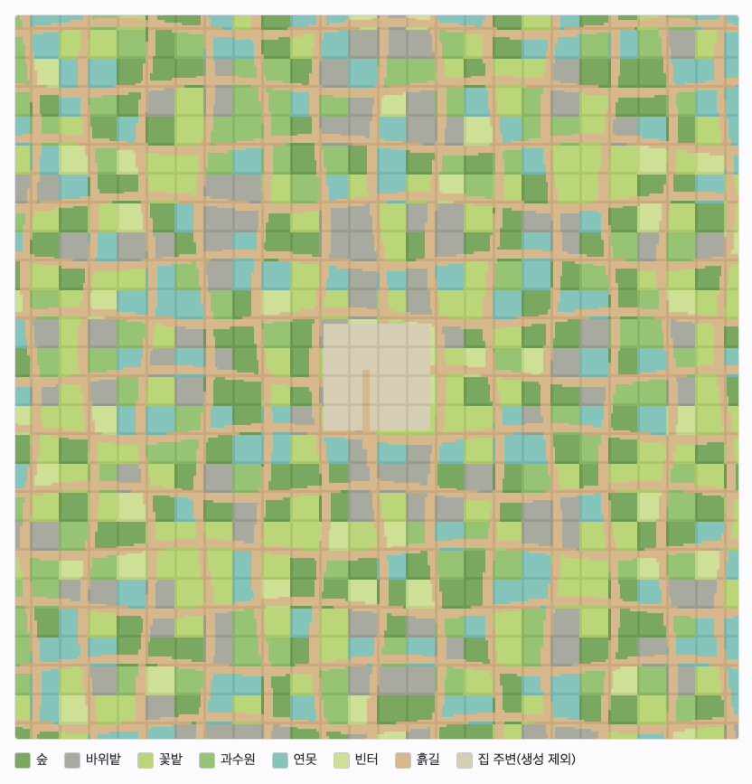
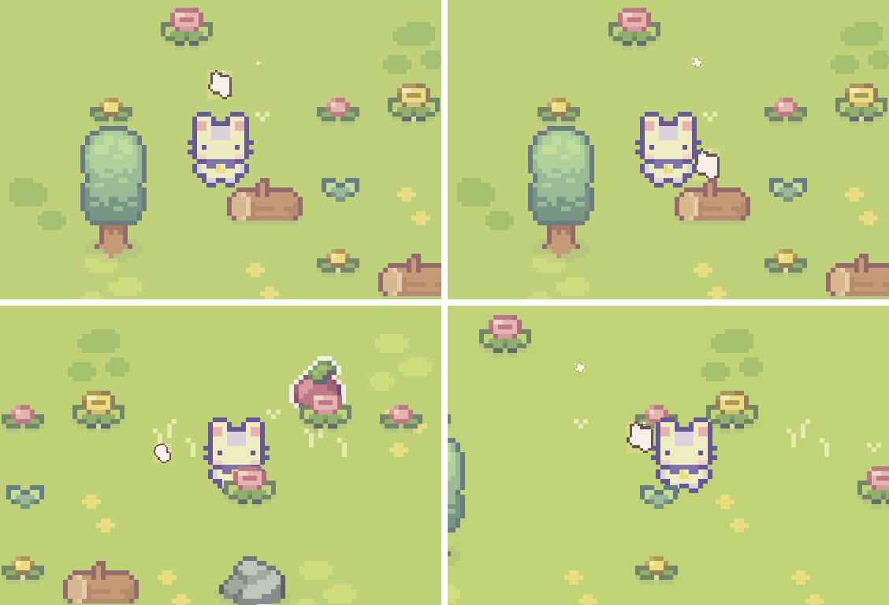
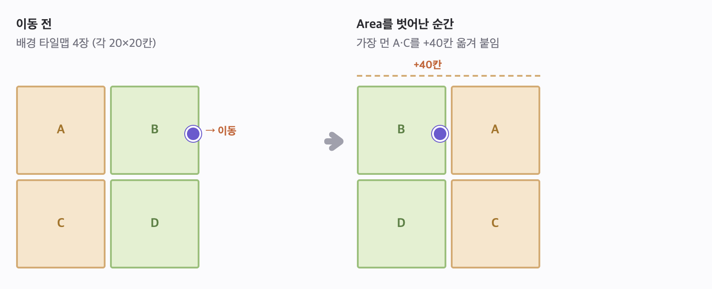
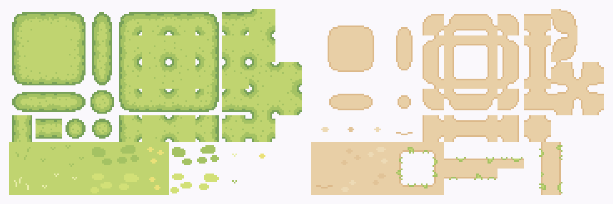
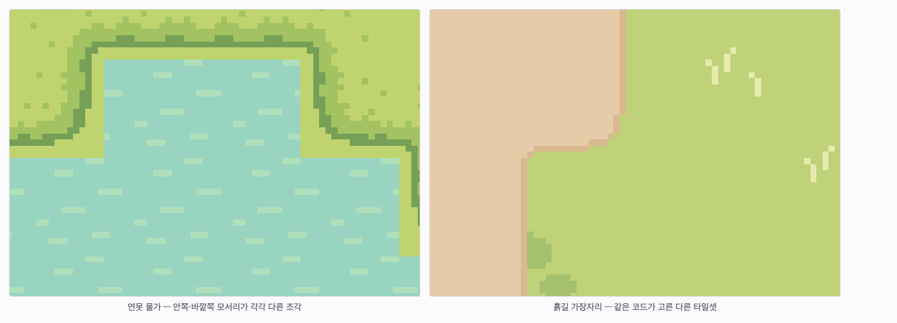
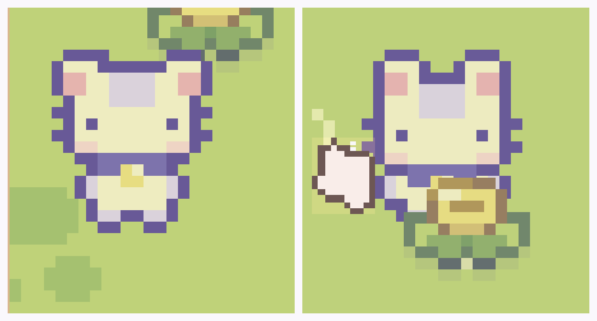
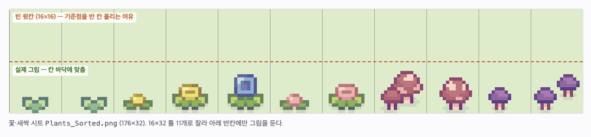
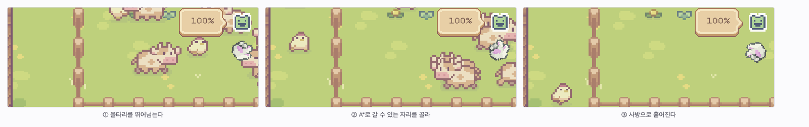
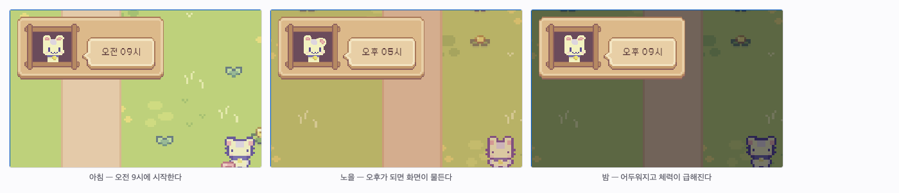

📅 2024.06.10 ~ 2024.06.24 · 업데이트 2026.09
| [🎮플레이](https://sprout-farm-beta.vercel.app)

**※ PC 환경에서만 작동합니다.** (방향키·Shift·Space 조작)

# *SproutFarm 새싹 농장*이란?


타일맵을 이용한 `탑다운` 2D `픽셀` 게임으로, 간단한 조작으로 짧은 시간에 누구나 쉽게 즐길 수 있는 `캐주얼` 미니 게임입니다.👾

## 게임 화면

| 도입 | 농장 |
|------|------|
|  |  |
| 파니가 상황을 설명해 줍니다. `SKIP▶▶`으로 건너뛸 수 있습니다. | 집과 울타리. 안내 대화가 조작 방법을 알려줍니다. |

| 들판 | 흙길 |
|------|------|
|  |  |
| 도망친 동물과 꽃·열매가 흩어져 있는 들판. | 들판을 가로지르는 흙길. 위를 달리면 덜 지치고 빨라집니다. |

| 연못 | 노을 |
|------|------|
|  |  |
| 구역마다 생기는 연못. 물은 지나갈 수 없습니다. | 시간이 지나면 화면 색이 바뀝니다. 오후가 되면 노을이 집니다. |

| 밤 | 결과와 랭킹 |
|------|------|
|  |  |
| 밤에는 어두워지고, 체력이 떨어지면 나침반이 집을 가리킵니다. | 점수 내역과 TOP 10 랭킹. 이름을 넣어 기록을 올릴 수 있습니다. |

## 어떤 게임인가요?

`파니`는 농장을 운영하고 있습니다. 평화롭던 어느날... 한눈을 판 사이에 키우던 동물들이 도망가 농장의 평화가 깨져버렸습니다!! 날이 지나면 동물들을 찾기가 어려워져요😱 자정이 되기 전에 동물들을 찾으러 갑시다..!

### 조작 방법

상하좌우 `방향키`로 움직이고 `Shift 키`로 달립니다. `Space 바`는 대화 넘기기, 울타리에 동물 넣기, 집에서 잠자기 같은 특수 행동에 씁니다. 자정이 지나기 전에 동물 20마리를 모두 잡아 울타리에 넣으면 승리합니다.

### 규칙

- **패배 조건** — 자정이 되거나 체력이 0%가 되면 집니다.
- **동물** — 도망 상태에서는 주변을 배회하다 플레이어가 다가오면 도망칩니다. 잡히면 플레이어를 따라다니고, 울타리에 넣으면 그 안을 돌아다닙니다.
- **체력** — 걸으면 천천히, 달리면 빠르게 닳습니다. 쉬지 않고 계속 움직이면 피로가 쌓여 더 빨리 닳고 이동 속도도 느려집니다. 멈춰 있으면 회복됩니다.
- **열매** — 들판의 열매를 먹으면 체력이 차고 잠시 빨라집니다.
- **잠자기** — 집 침대에서 `Space`로 자면 체력이 가득 차고 게임 시계가 1시간 지나갑니다. 체력이 70% 이상이면 잠이 오지 않습니다.
- **흙길** — 길 위에서는 체력이 평소의 35%만 닳고 1.25배 빨리 움직입니다.

### 점수와 랭킹

한 판이 끝나면 아래 공식으로 점수를 매기고, 이름을 넣어 랭킹에 올릴 수 있습니다. 진행 중에도 화면 왼쪽 아래에 실시간 점수가 표시됩니다.

| 항목 | 점수 |
|------|------|
| 잡은 동물 (따라오는 중 포함) | 마리당 100 |
| 먹은 열매 | 개당 20 |
| 남은 체력 | 1%당 5 |
| 자정까지 남은 게임 시간 | 1분당 2 × (잡은 동물 ÷ 20) |
| 클리어 보너스 | 1000 |

랭킹은 TOP 10을 보여주고, 클리어한 기록에는 걸린 시간도 함께 표시됩니다. 점수는 서버에서 같은 공식으로 다시 계산해 저장하므로 임의의 점수를 올릴 수 없습니다.

### 맵 구성



*게임의 생성 규칙을 그대로 옮겨 그린 미리보기입니다. 가로세로 300칸(25구역) 범위로, 구역마다 풍경이 정해지고 흙길이 그물처럼 이어집니다.*

- 픽셀 아트로 된 평화로운 자연 배경입니다. 타일맵으로 되어 있으며, 크기에 제한을 두지 않는 **무한 맵**입니다.
- 집에서 멀어지면 같은 벌판이 이어지지 않도록, 플레이어 주위를 12칸짜리 구역으로 나눠 **숲 · 바위밭 · 꽃밭 · 과수원 · 연못 · 빈터** 중 하나를 깔아 둡니다. 구역의 위치로 풍경이 정해지므로 같은 곳에 다시 가면 같은 풍경이 나옵니다.
- **연못**에는 물가와 수련잎이 생기고 물은 지나갈 수 없습니다. **흙길**은 24칸 간격으로 구불구불 이어지며, 집 현관 앞에서 남쪽 큰길까지 진입로가 놓여 있습니다.
- 소와 닭은 플레이어가 추적하는 대상입니다. 맵 내부를 자유롭게 돌아다니다가 플레이어가 가까이 다가오면 플레이어를 피해 도망갑니다.



*돌아다니며 만나는 풍경. 구역에 따라 나무·그루터기, 꽃·버섯, 바위가 섞여 깔립니다.*

### 기술 스택

| 분류 | 사용 기술 |
|------|-----------|
| 엔진 | Unity 6 (6000.6.2f1), C# |
| 렌더링 | URP 17.6 · 2D Renderer, 투명 정렬 축을 Y로 둔 커스텀 정렬 |
| 맵 | Tilemap (Rule Tile, 47조각 블롭 타일셋), 런타임 절차적 생성 |
| 입력 | Input System 1.20 |
| AI | A* Pathfinding Project 4.2.17 (Grid Graph, 부분 재스캔) |
| UI | uGUI · TextMeshPro |
| 배포 | WebGL (Brotli 압축) → Vercel 정적 호스팅 |
| 서버 | Vercel 서버리스 함수 (`api/scores.js`) + Redis |
| 웹 | Service Worker (network-first 캐시), 랭킹 UI는 HTML·JS |

# Features

## [Assets](https://cupnooble.itch.io/sprout-lands-asset-pack)

[](https://cupnooble.itch.io/sprout-lands-asset-pack)

| Player | Particle |
|----------|----------|
|  |  |

| Cow | Chicken |
|----------|----------|
|||

| House | Animal House | Fences |
|----------|----------|----------|
||||

| Plants | Grass |
|----------|----------|
|||

| Water | Dirt |
|----------|----------|
|||

| Dialogue Boxes | Emote |
|----------|----------|
|||

| SFX | Font |
|----------|----------|
|||

## Scripts


### 씬 구성

| Intro Scene | Game Scene | Clear Scene |
|----------|----------|----------|
|  |  |  |
| 게임을 시작할 때 띄우는 도입 화면입니다. | 실제 게임을 플레이 하는 화면입니다. | 게임 종료 조건 달성 시 승리, 또는 패배 결과와 랭킹을 띄우는 화면입니다. |

### Level Design


## 구현 메모

### 1. 무한 맵



배경으로 쓰는 4개의 타일맵(각 20×20칸)이 플레이어를 따라다닙니다. 각 타일맵에는 `Area` 트리거가 달려 있고, 플레이어가 한 덩어리의 경계를 벗어나는 순간 가장 먼 덩어리를 진행 방향 쪽으로 40칸 옮겨 붙입니다.

```csharp
// Reposition.cs — 경계를 벗어난 순간, 가장 먼 타일맵을 진행 방향으로 옮긴다
private void OnTriggerExit2D(Collider2D collision)
{
    if (!collision.CompareTag("Area")) return;

    Vector3 playerPos = GameManager.instance.player.transform.position;
    float diffX = Mathf.Abs(playerPos.x - transform.position.x);
    float diffY = Mathf.Abs(playerPos.y - transform.position.y);

    Vector3 playerDir = GameManager.instance.player.inputVector;
    float dirX = playerDir.x < 0 ? -1 : 1;
    float dirY = playerDir.y < 0 ? -1 : 1;

    if (diffX > diffY)      transform.Translate(Vector3.right * dirX * 40); // 가로로 더 멀면 좌우로
    else if (diffX < diffY) transform.Translate(Vector3.up    * dirY * 40); // 세로로 더 멀면 위아래로
}
```

플레이어와의 거리(`diffX`·`diffY`)로 **어느 축으로** 옮길지, 입력 방향(`inputVector`)으로 **어느 쪽으로** 옮길지 정합니다. 타일맵 4장만 돌려쓰므로 맵이 아무리 넓어져도 비용이 늘지 않습니다. 대신 맵이 움직여도 플레이어의 좌표는 계속 커지므로, 그 위에 올리는 것들은 모두 **세계 좌표 기준**으로 계산합니다.

### 2. 절차적 지형 생성 (`WildTerrain`)

무한 맵이 같은 풍경만 반복하지 않도록, 플레이어 주위를 12칸짜리 구역으로 나눠 3×3 범위를 만들고 멀어진 구역은 지웁니다.

**결정적 생성** — 구역의 풍경은 좌표를 섞은 해시로 정합니다. 저장해 두지 않아도 같은 자리에 다시 가면 같은 풍경이 나옵니다.

```csharp
// 숲 3 : 바위밭 2 : 꽃밭 3 : 과수원 2 : 연못 3 : 빈터 1 — 뽑기 주머니로 비중을 준다
private static readonly Theme[] ThemeBag =
{
    Theme.Woods, Theme.Woods, Theme.Woods,
    Theme.Rocky, Theme.Rocky,
    Theme.Meadow, Theme.Meadow, Theme.Meadow,
    ...
};

// 구역 좌표를 큰 소수로 섞어 구역마다 다른 난수를 얻는다
state.random = new System.Random(seed ^ (chunk.x * 73856093) ^ (chunk.y * 19349663));
state.theme  = ThemeBag[state.random.Next(ThemeBag.Length)];
```

**프레임 분할** — 한 구역(144칸)을 한 프레임에 다 만들면 달릴 때마다 화면이 멎습니다. 꾸밀 칸 목록을 들고 있다가 **프레임당 48칸씩**만 처리하고 나머지는 다음 프레임으로 넘깁니다.

```csharp
private void Decorate(BuildState state)
{
    int limit = Mathf.Min(state.index + cellsPerFrame, state.cells.Count); // cellsPerFrame = 48
    for (; state.index < limit; state.index++)
    {
        // 풍경에 따라 나무·꽃·바위를 놓는다
    }

    if (state.index < state.cells.Count) return; // 아직 남았으면 다음 프레임에 이어서

    building = null;
    // 길을 막는 것(나무·바위·물)이 실제로 생겼을 때만 A* 그래프를 다시 읽는다
    if (state.solidChanged || state.water.Count > 0) RescanPaths(state.chunk);
}
```

한 프레임에 몰아 만들 때 **377ms**까지 튀던 프레임이, 분할과 조건부 재스캔을 넣고 100ms대로 내려갔습니다. A\* 재스캔도 구역 범위만 `Bounds`로 넘겨 부분 갱신합니다.

**블롭 타일셋** — 연못 물가와 흙길 가장자리는 47조각 타일셋에서 이웃 8칸의 모양을 보고 고릅니다.



*왼쪽이 연못 물가(잔디), 오른쪽이 흙길(흙) 타일셋입니다.*

```csharp
// 이웃 8칸이 '같은 바닥'인지를 8글자 키로 만들어 47조각 중 하나를 찾는다
private static bool BlobLookup(System.Func<int, int, bool> same, out int sprite)
{
    bool top = same(0, 1), bottom = same(0, -1), left = same(-1, 0), right = same(1, 0);
    char Side(bool isSame) => isSame ? 'G' : 'w';
    string look = new string(new[]
    {
        Side(top && left && same(-1, 1)),   Side(top),    Side(top && right && same(1, 1)),
        Side(left),                                       Side(right),
        Side(bottom && left && same(-1, -1)), Side(bottom), Side(bottom && right && same(1, -1)),
    });
    return ShoreLookup.TryGetValue(look, out sprite);
}
```

대각선 이웃은 **양옆이 모두 같을 때만** 같다고 봅니다(`top && left && same(-1, 1)`). 이 조건이 없으면 모서리에서 엉뚱한 조각이 뽑혀 가장자리가 끊겨 보입니다. 판정 함수 `same`만 바꿔 끼우면 같은 코드가 물가와 흙길 양쪽에 그대로 쓰입니다.



**이어지는 길** — 길은 좌표만 넣으면 답이 나오는 순수 함수라, 구역을 따로 만들어도 경계에서 어긋나지 않습니다.

```csharp
private bool OnPathBand(int x, int y)
{
    int row = Mathf.RoundToInt((float)y / pathSpacing);          // pathSpacing = 24
    for (int k = row - 1; k <= row + 1; k++)
    {
        // 24칸 간격의 가로길이 sin 곡선을 따라 구불거린다
        float center = k * pathSpacing + pathWander * Mathf.Sin(x * pathCurve + k * 2.3f);
        if (Mathf.Abs(y - center) <= pathWidth) return true;
    }
    // 세로길도 x·y만 바꿔 같은 방식으로 판정한다
    ...
}

private bool OnPath(int x, int y)
{
    return OnHomePath(x, y)
        || OnPathBand(x, y)
        || (OnPathBand(x - 1, y) && OnPathBand(x + 1, y))   // 비스듬한 구간에서 생기는
        || (OnPathBand(x, y - 1) && OnPathBand(x, y + 1));  // 한 칸짜리 구멍을 메운다
}
```

곡선이 비스듬히 지나가는 구간에서는 칸이 계단처럼 어긋나 길이 갈라져 보였습니다. 위아래(또는 좌우)가 모두 길이면 가운데도 길로 쳐서 메우니 대각선도 하나로 이어집니다. 집 앞 진입로(`OnHomePath`)는 집·울타리·밭 타일이 있는 칸을 비켜 남쪽 큰길까지 내려갑니다.

**장식 정리** — 물과 길 위에 원래 깔려 있던 꽃은 치워 두고, 무한 맵이 움직여 다른 꽃이 그 자리로 오면 다시 치웁니다. 구역을 지울 때는 치워 둔 것을 원래대로 되돌립니다.

### 3. 그리는 순서(레이어)



*왼쪽 — 꽃이 캐릭터보다 위(북쪽)에 있으면 뒤에 그려집니다. 오른쪽 — 아래(남쪽)에 있으면 앞으로 나와 다리만 가립니다.*

캐릭터·동물·나무·꽃이 모두 **같은 정렬 층(order 3)** 에서 위치로 앞뒤가 정해집니다. URP 2D Renderer의 투명 정렬 축을 Y로 두고, 타일맵은 `Individual` 모드로 두어 타일 하나하나가 따로 정렬되게 했습니다.

```csharp
// BaseGrass.cs — 타일맵을 만들 때 정렬 층과 모드를 직접 맞춘다
private Tilemap CreateTilemap(string name, int order, TilemapRenderer.Mode mode)
{
    ...
    tilemapRenderer.sortingOrder = order; // 캐릭터·동물·나무와 같은 층
    tilemapRenderer.mode = mode;          // Individual = 칸 하나하나가 따로 정렬된다
    // 꽃 그림틀이 칸보다 한 칸 높아서, 반 칸 올려야 그림이 제자리에 온다
    tilemapObject.transform.localPosition = new Vector3(0f, 0.5f, 0f);
    return tilemap;
}
```

- **기준점 통일** — 스프라이트를 `FullRect`로 불러와 칸 전체가 경계가 되게 하고, 그림을 칸 바닥에 붙여 모든 오브젝트가 "밑동 + 반 칸"이라는 같은 기준을 갖게 했습니다. `Tight`로 두면 작은 새싹은 잎사귀 한가운데가 기준이 되어, 캐릭터 발보다 위에 있어도 앞으로 튀어나옵니다.
- **여유 두기** — 꽃·새싹은 그림틀만 한 칸 더 높게 만들어 기준점을 반 칸 올렸습니다. 덕분에 캐릭터 발보다 확실히 앞에 있을 때만 앞으로 나와, 다리만 가리고 몸통·머리는 가리지 않습니다.



- 소는 그림이 두 칸 높이라 기준이 발보다 한 칸 가까이 위에 잡혀 있었는데, 칸 안에서 그림을 올려 캐릭터와 같은 기준으로 맞췄습니다(잘리지 않게 위쪽 여백만큼만).

### 4. 동물 AI



동물이 플레이어를 쫓거나 피할 때 경로를 직선으로만 계산하면 장애물에 걸려 멈춥니다. A\* 길찾기(Grid Graph)로 장애물을 피해 움직이며, 상태에 따라 행동이 달라집니다.

```csharp
// GameManager.cs — 울타리에서 멀고, 플레이어가 걸어갈 수 있는 빈 곳을 고른다
for (int attempt = 0; attempt < 30; attempt++)
{
    float spread = 20f + attempt * 6f; // 처음엔 정해진 방향 근처, 잘 안 되면 점점 넓게
    float radians = (angle + Random.Range(-spread, spread)) * Mathf.Deg2Rad;
    float distance = Random.Range(minScatterDistance, maxScatterDistance);
    Vector2 point = penCenter + new Vector2(Mathf.Cos(radians), Mathf.Sin(radians)) * distance;
    ...
    NNInfo nearest = AstarPath.active.GetNearest(point, NNConstraint.Default);
    // 물·바위에 둘러싸여 영영 못 잡는 자리에 떨어지지 않도록 걸어갈 수 있는지 확인한다
    if (nearest.node == null || !PathUtilities.IsPathPossible(playerNode, nearest.node)) continue;
    point = nearest.position;
}
```

- **탈출** — 게임이 시작되면 울타리 밖으로 뛰어넘는 연출과 함께 사방으로 흩어집니다. 목적지는 `IsPathPossible`로 **플레이어가 실제로 걸어갈 수 있는지** 확인한 자리 중에서 고릅니다.
- **도망 · 추종 · 우리 안** — 플레이어가 가까우면 반대 방향으로 도망치고, 잡히면 따라다니며, 울타리에 넣으면 그 안을 배회합니다.

### 5. 시간 · 체력



게임은 오전 9시에 시작해 자정에 끝납니다. 게임 시간 1분이 실제 1.2초라 한 판이 약 18분입니다. 체력도 실제 시간이 아니라 **게임 시간 기준**으로 닳습니다.

```csharp
// DayNightCycle.cs — 게임 시간 1분마다 호출된다
private void DecreasePlayerStamina()
{
    // 쉬지 않고 걸으면 게임 시간 3시간(hoursToExhaustion)에 바닥나는 양
    float baseStaminaDecreaseRate = 100f / (hoursToExhaustion * minutesPerHour);
    // playerSpeed는 Player가 넘겨주는 배율 (걷기 1배, 달리기·피로가 쌓이면 그만큼 커진다)
    float decrease = playerSpeed != 0f
        ? baseStaminaDecreaseRate * playerSpeed
        : baseStaminaDecreaseRate * idleDrainRatio;   // 멈춰 있으면 조금만
    if (playerOnPath) decrease *= pathDrainRatio;     // 흙길은 걷기 편해서 천천히 닳는다 (35%)
    playerStatus.DecreaseStamina(decrease);
}
```

흙길 판정은 캐릭터의 **발 위치**로 합니다. 지형이 정해진 함수로 만들어져 있어 콜라이더 없이 좌표만 넘겨 물어보면 됩니다.

```csharp
// Player.cs — 발끝 좌표로 길 위인지 묻고, 길이면 더 빨리 움직인다
bool onPath = WildTerrain.OnPathAt(transform.position + Vector3.down * feetOffset);
if (onPath) currentSpeed *= pathSpeedMultiplier;      // 1.25배
dayNightCycle.SetOnPath(onPath);
```

### 6. 랭킹 서버


`api/scores.js`(Vercel 서버리스 함수)가 제출된 기록으로 점수를 **다시 계산**해 Redis 정렬 집합에 저장하고 TOP 10을 돌려줍니다.

```js
// api/scores.js — Unity의 GameResult.Calculate와 같은 공식
const POINTS = { animal: 100, berry: 20, clearBonus: 1000, remainingMinute: 2, stamina: 5 };
// 한 판에서 나올 수 있는 최대치. 제출값은 여기에 맞춰 잘라낸다.
const LIMITS = { animals: 20, berries: 100, remainingMinutes: 15 * 60, stamina: 100, clearSeconds: 3600 };

function scoreOf(record) {
  // 남은 시간 점수는 잡은 비율만큼만 — 일찍 쓰러졌다고 점수가 커지지 않는다
  const timePoints = Math.floor(
    (record.remainingMinutes * POINTS.remainingMinute * record.animals) / TOTAL_ANIMALS);
  return record.animals * POINTS.animal + record.berries * POINTS.berry + timePoints
    + record.stamina * POINTS.stamina + (record.victory ? POINTS.clearBonus : 0);
}
```

클라이언트가 보내는 것은 **점수가 아니라 잡은 동물 수·먹은 열매 수 같은 기록**이고, 서버가 그 값을 한 판에서 나올 수 있는 범위로 자른 뒤 직접 계산합니다. 이름은 10자까지, 연속 제출은 10초 간격으로 제한합니다. Redis 접속 정보는 저장소에 두지 않고 Vercel 환경 변수로만 넘깁니다.

### 7. 웹 배포

WebGL 빌드를 Brotli로 압축해(`.unityweb`) Vercel에 올립니다. 정적 호스팅이라 압축 파일임을 알려 줄 헤더를 직접 붙여야 브라우저가 풀어서 읽습니다.

```json
// vercel.json
{ "source": "/Build/(.*)\\.unityweb",
  "headers": [{ "key": "Content-Encoding", "value": "br" }] }
```

Service Worker는 **network-first**로 동작합니다. 캐시를 먼저 보면 새 빌드를 올려도 옛 게임이 계속 뜨기 때문입니다.

```js
// ServiceWorker.js — 항상 네트워크를 먼저, 실패했을 때만 캐시
try {
  const response = await fetch(e.request);
  // 랭킹 응답은 늘 최신이어야 하므로 정적 파일만 캐시에 넣는다
  if (e.request.method === 'GET' && response.status === 200
      && !new URL(e.request.url).pathname.startsWith('/api/')) {
    (await caches.open(cacheName)).put(e.request, response.clone());
  }
  return response;
} catch (error) {
  const cached = await caches.match(e.request);
  if (cached) return cached;
  throw error;
}
```

## Demo

[🎮플레이](https://sprout-farm-beta.vercel.app)

**※ PC 환경에서만 작동합니다.**

[](https://youtu.be/XFgvLMcFpRo?si=RFJwEilEIvX2IQv9)

<details>
    <summary>영상 설명</summary>
    <div>
        <p>시연 영상입니다. (업데이트 전 버전이라 연못·흙길·랭킹은 나오지 않습니다.)<br>
        빠른 시간 안에 모든 기능을 보여주기 위해 플레이 타임이 짧아지도록 설정을 바꾼 상태입니다.<br>
        <ol>
            <li>잡아야 하는 동물 수를 줄였습니다.</li>
            <li>현재는 1시간에 약 72초로 한 판이 약 18분입니다.<br>
            → 영상에서는 1시간에 5초로 변경해 플레이 타임을 대폭 줄였습니다.</li>
        </ol>
        [UI]
        <ol>
            <li>좌측 상단 시간에 따라서 화면의 밝기가 달라집니다. 새벽, 한낮, 노을, 밤으로 구성되어 있습니다.</li>
            <li>우측 상단 말풍선은 체력을 나타냅니다.</li>
            <li>우측 상단 화살표는 가장 가까운 동물의 방향을 알려주는 나침반입니다.<br>
            → 동물을 다 포획한 경우, 또는 체력이 얼마 남지 않은 경우 나침반은 집을 가리킵니다.</li>
            <li>좌측 하단에 실시간 점수, 우측 하단에 남은 동물 수를 표시합니다.</li>
            <li>플레이 방법을 안내하는 대화 상자가 있고, 도입부 대화는 SKIP 버튼으로 건너뛸 수 있습니다.</li>
        </ol>
        </p>
    </div>
</details>

### Team members
- 🧑‍💻 김정현(Jeong-Hyeon Kim) `hyeoniverse.dev@gmail.com`
